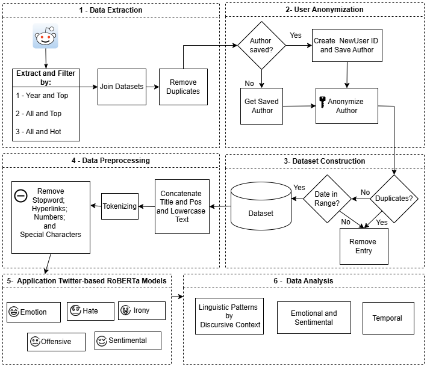

# 💬 **Pain in a Safe Space: Temporal Analysis of Discourses in the Womenintech Subreddit**

This repository contains the code, data, and materials used in our study on the temporal dynamics of toxicity and emotional expression in the *r/womenintech* subreddit over the span of one year.

---

## 📄 Abstract

This study analyzes online discourse in the *r/womenintech* subreddit to assess patterns of toxicity and emotional expression over time. We employed NLP techniques and the Goal-Question-Metric (GQM) framework to guide our analysis. Our results reveal temporal trends and emotional nuances in discussions within a safe space for women in tech.

---

## 🗂️ Repository Structure
├── dataset/ # Raw and preprocessed data used in the study

├── graphics/ # Figures and visualizations generated for the article

├── src/ # Source code for preprocessing, analysis, and modeling

├── table Emotion by Sentiment/ # Example of posts categorized by emotion and sentiment.

├── requirements.txt # List of libraries and specific versions required to reproduce the project environment

├── env.example # Example of env file

├── LICENSE # MIT

└── README.md # Project documentation

## 🔐 Environment Configuration

Before running the scripts, make sure to create a `.env` file in the root directory of the project. This file should contain your API credentials and user agent, as shown below:

  ```env
        CLIENT_ID=your_reddit_client_id
        CLIENT_SECRET=your_reddit_client_secret
        AGENT=your_custom_user_agent
````
 * These values are required to access the Reddit API. You can obtain them by registering an application at https://www.reddit.com/prefs/apps.
 * If you have any questions, refer to the `env.example` file for guidance.

## ⚙️ How to Reproduce

1. **Install the dependencies:**

   ```bash
   pip install -r requirements.txt
   ```

2. **Prepare the environment:**

   - Make sure to place the `.env` file inside the `src/` directory.  
   - Run the notebooks using **Jupyter Notebook**, **JupyterLab**, or any compatible IDE (e.g., VSCode with Jupyter extension).

3. **Run the scripts in the following order:**

   - `src/1_extract_subreddit.ipynb`: Extracts data from the target subreddit.
   - `src/2_anonymization_reddit.ipynb`: Anonymizes usernames and sensitive information.
   - `src/3_label_reddit.ipynb`: Applies labeling or classification to the dataset.
   - `src/4_analysis_reddit.ipynb`: Performs analysis and visualization based on the processed data.

##  💾 Dataset
The dataset includes Reddit posts from the *r/womenintech* subreddit collected over a one-year period. Personal information has been removed or anonymized where appropriate. Data files are located in the dataset folder.


## 🧪 Methodology

The pipeline consists of six main steps for processing and analyzing Reddit data:



1. **Data Extraction**  
   Reddit posts are collected using multiple filters (e.g., year, top, hot posts). Datasets are joined, and duplicates are removed.

2. **User Anonymization**  
   To ensure privacy, user IDs are anonymized using consistent unique identifiers. Previously encountered users are retrieved from saved mappings.

3. **Dataset Construction**  
   Filtered posts are included based on date range and uniqueness, ensuring relevance and integrity in the dataset.

4. **Data Preprocessing**  
   Preprocessing involves the removal of stopwords, hyperlinks, numbers, and special characters. Texts are tokenized, concatenated, and lowercased.

5. **RoBERTa-based Classification**  
   Twitter-optimized RoBERTa models classify the data into categories: **emotion**, **hate speech**, **irony**, **offensiveness**, and **sentiment**.

6. **Data Analysis**  
   The labeled dataset is analyzed to identify:
   - Discursive linguistic patterns  
   - Emotional and sentimental trends  
   - Temporal shifts in expression
  

## 📈 Results
Visual outputs such as time-series plots and emotion distributions are available in the graphics folder. These figures were used in the paper to illustrate key findings.
